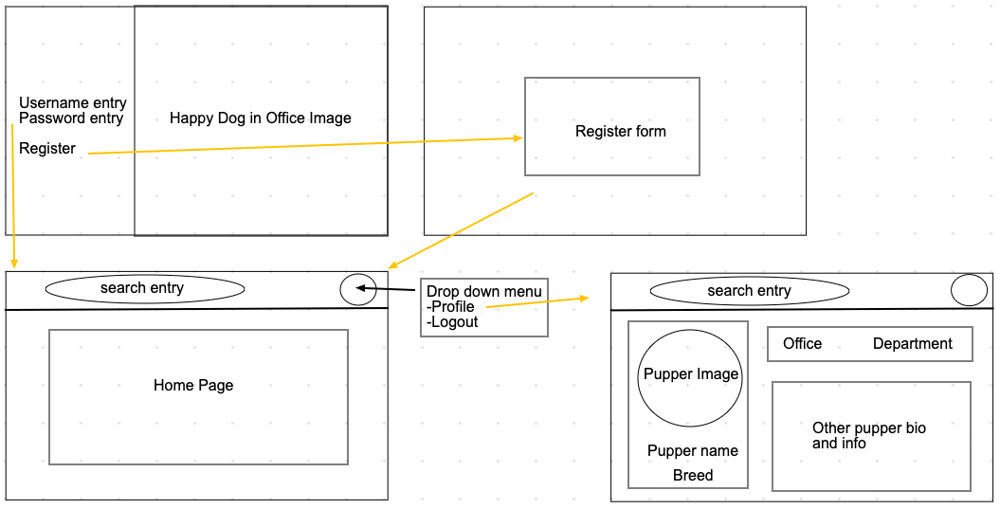
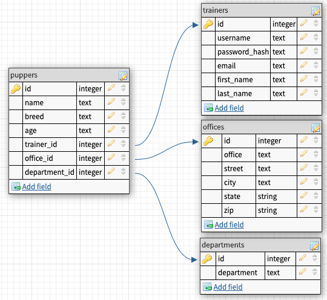

# CoPupper
Deployed App: https://copupper.herokuapp.com/
## The App
Ever wanted a way to find out what dogs might work at the same office you do, well now you can with CoPupper! An app thats adjacent to your company's HR system, CoPupper will let you add your own pupper so your fellow coworkers will know where to stop by to see the goodest of puppers!

### Wireframes

### DB

### User Stories
 1. As a user, I want to be able to create a profile for my pupper to show I bring them into the office.
 2. As a user, I want to be able to edit the profile for my pupper.
 3. As a user, I want to be able to view my pupper’s profile, and the profile of other pupper’s.
 4. As a user, I want to be able to add a profile image for my copupper.

### Technologies
- Reactjs
- Ruby 2.6.6
- Rails 6
- Cloudinary for Image Hosting, with the cloudinary Gem added to gemfile

### Deployment to Heroku
 1. Create heroku app
 2. Add Heroku Postgres element to your app.
 3. In Heroku app settings add buildpacks for "heroku/nodejs" and "heroku/ruby".  Ensure the nodejs buildpack is the first (top) buildpack.
 4. Create Cloudinary account, and make note of your cloud name, api key, and api secret in your Cloudinary dashboard.
 5. In Heroku app settings, reveal your config vars and add new config vars for "CLOUDINARY_NAME" (your cloud name), "CLOUDINARY_API" (your api key), and "CLOUDINARY_API_SECRET" (your api secret). (If you want to start locally, create a .env file in the app's root folder in your with these variable names and add your cloudinary account values to each)
 6. Push your app to Heroku.
 7. When the build is done, run the command for "heroku run rake db:migrate" (if your build did not already migrate), and then "heroku run rake db:seed" to load up the data from the seed file.
 8. You should now be able to login to the deployed heroku app.
